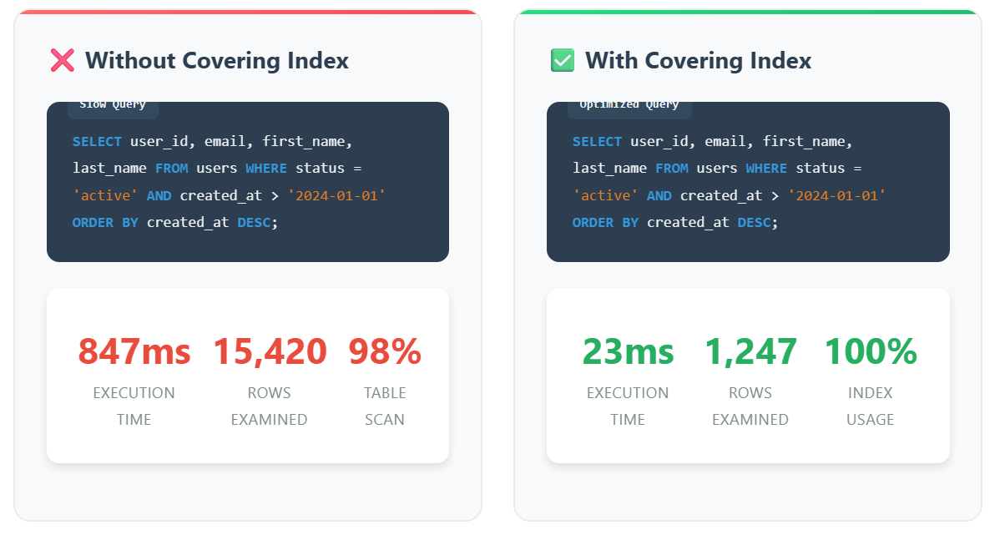
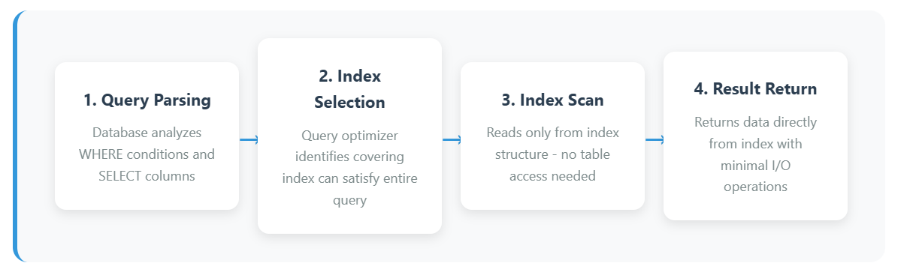

If you've ever run a SQL query that felt like it was stuck in a traffic jam, chances are it was doing a full table scan when it didn't have to. Recently, I optimized a high-traffic system by introducing covering indexes — and the results were wildly impressive.

## What Is a Covering Index Anyway?

A covering index is a type of index that includes all the columns required by your query. That means the database can answer the query just by looking at the index, without ever touching the underlying table. This avoids unnecessary I/O, making queries insanely faster.

## Performance Before vs After

Here's a side-by-side look at a SELECT query that pulls user data based on status and created date. The only change? A covering index.

- Without index: 847ms
- With covering index: 23ms

That's a 36.8x speed improvement. Wild, right?

## Deep Dive: What's Happening Behind the Scenes?

Let's break it down:

### Execution Time
Without index: 847ms / With covering index: 23ms

### Rows Examined
Without index: 15,420 / With covering index: 1,247

### Index/Table Usage
Without index: 98% table scan / With covering index: 100% index usage

Same query, same table. The only difference? I created a covering index on status, created_at, and the selected columns — and that made all the difference.

## Real-World Results in Production

This wasn't just a one-off. After rolling out covering indexes across a busy e-commerce system, here's what we saw:

- User Search Queries: 650ms → 18ms (36x faster)
- Admin Dashboard Loads: 3.2s → 89ms (35x faster)
- API Response Times: 1.8s → 65ms (27x faster)
- Server CPU Usage: Dropped by 40%

Indexing paid for itself in performance gains, and then some.

## How Covering Indexes Work

- **Query Parsing:** DB figures out which columns you're selecting and filtering.
- **Index Selection:** Optimizer notices the covering index can satisfy the query.
- **Index Scan:** Only the index is read, no table access required.
- **Result Return:** Data comes straight from the index with minimal I/O.

## Trade-off: Storage vs Speed

Everything comes at a cost though. Covering indexes do take more space — sometimes 2-3x more than regular indexes. But they can cut query times by 10x to 50x. If you're optimizing read-heavy queries on high-traffic endpoints, the speed gain is absolutely worth the extra storage.
