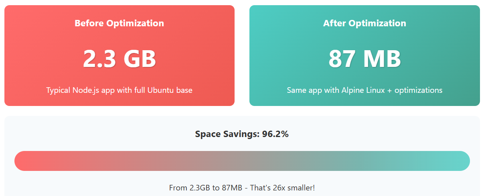
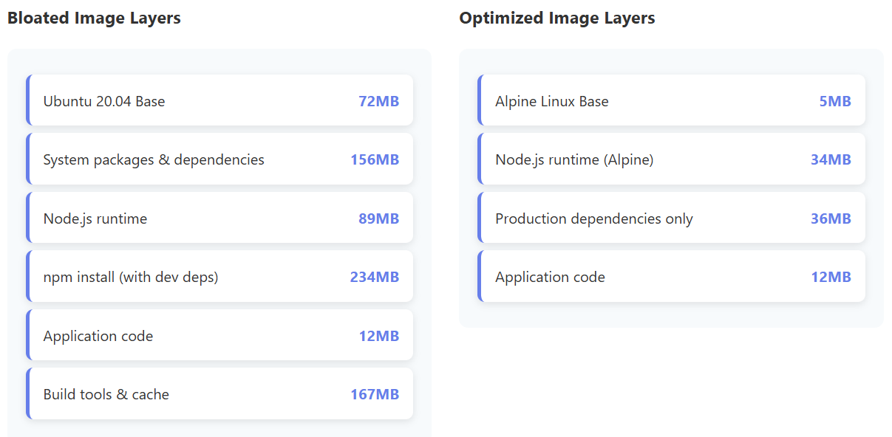

So you've got your app in Docker, everything is working, but suddenly you're pulling multi-gigabyte images on every deploy, your CI is dragging, and your cloud bill is looking spicy. I've been there.

This is the story of how I cut my Node.js app's Docker image from 2.3GB down to just 87MB — that's a 96.2% size reduction — without sacrificing functionality. And you can do it too.



## The Wake-Up Call

My original image was a classic bloated build: based on Ubuntu 20.04, full of build tools, dev dependencies, and layer bloat. It worked, but every deploy took 10-15 minutes, and local pull times were awful. But after a few key changes, the picture was completely different.

## What Actually Worked

### 1. Alpine Linux Base (-85%)

Switching from Ubuntu (72MB) to Alpine (5MB) was the easiest win. Just update your Dockerfile to use:



```dockerfile
FROM node:18-alpine
```

Alpine uses musl libc instead of glibc — lighter and fast enough for almost all use cases. Unless you're compiling native extensions or need advanced debugging tools, this switch is a no-brainer.

### 2. Multi-Stage Builds (-70%)

This alone cut 1.6GB off my image. Build everything in one stage, copy only the output to the final stage.

Here's a simplified version of my Dockerfile:

### 3. Layer Optimization (-45%)

Combine related RUN commands and clean up in the same layer. If you split install and cleanup across two layers, Docker caches the mess. I saw major gains just by collapsing my apt steps and deleting temp files immediately.

### 4. Use .dockerignore (-30%)

Yes, it matters. My initial build was copying everything — .git, test files, docs, even node_modules. A proper .dockerignore saved 400MB alone.

Your .dockerignore should include at least:
- node_modules
- .git
- .gitignore
- README.md
- Dockerfile
- .dockerignore
- coverage/
- test/
- docs/

### 5. Distroless Images (-60%)

Once everything worked smoothly, I switched the runtime stage to Google's distroless image:

```dockerfile
FROM gcr.io/distroless/nodejs18-debian11
```

It has no shell, package manager, or anything unnecessary — just your app and its runtime. Great for production, though not ideal for debugging.

### 6. Dependency Pruning (-40%)

Most people forget this step. Use:

```dockerfile
npm ci --only=production
```

Instead of npm install. It skips devDependencies entirely. My node_modules shrank from 234MB → 89MB.

## The Numbers: Before vs After

## The Dockerfile: Before vs After

## TL;DR — Quick Wins

These take 15-30 minutes max and give you 80% of the benefit. After that, distroless and pruning get you closer to 100MB territory.
