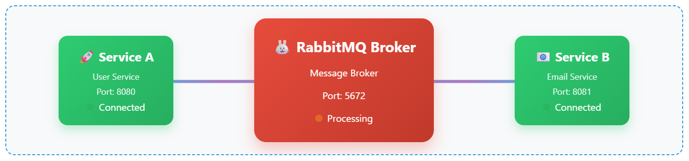
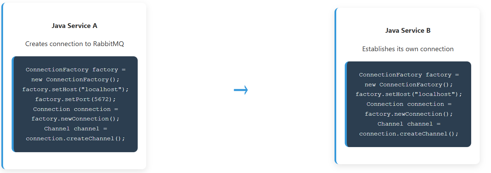
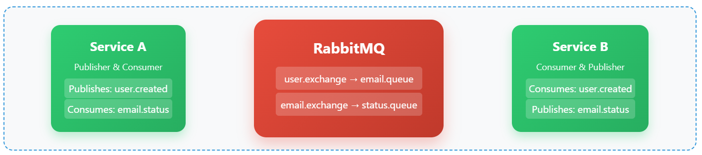

In modern distributed systems, microservices frequently need to communicate asynchronously. RabbitMQ is a robust message broker that enables seamless, decoupled communication between Java microservices. This post explores a practical scenario: two Java microservices exchanging messages back and forth using RabbitMQ. We'll go beyond the basics, focusing on technical design, message flow, and code structure, with visualizations to clarify each step.

## Architecture Overview

**Service A (User Service)** — A Java microservice running on port 8080 that handles user registration and management. It acts as both a message publisher (sending user events) and consumer (receiving status updates).

**RabbitMQ Broker** — The central message broker running on port 5672 that handles message routing, storage, and delivery between services. It manages exchanges, queues, and ensures reliable message delivery.

**Service B (Email Service)** — A Java microservice on port 8081 that processes email-related tasks. It consumes user events and publishes status updates back to Service A.

## Connections Establishment Process

Both Java services establish connections to RabbitMQ using the AMQP client library:

- **Connection Factory Setup:** Each service creates a ConnectionFactory instance, configures the RabbitMQ host (localhost) and port (5672), then establishes a TCP connection to the broker.
- **Channel Creation:** After connection, each service creates one or more channels — lightweight connections that share the underlying TCP connection. Channels are where actual AMQP operations (publish, consume, declare) happen.
- **Connection Pooling:** In production, services typically use connection pools to manage multiple connections efficiently, as connections are expensive to create and maintain.

## Exchange and Queue Setup

- **Exchange Declaration:** Services declare exchanges that act as message routers. A "direct" exchange routes messages to queues based on exact routing key matches. Services can also use "topic" exchanges for pattern-based routing or "fanout" for broadcasting.
- **Queue Declaration:** Services declare durable queues that persist messages even if the broker restarts. Queue names like "email.queue" are bound to exchanges with specific routing keys.
- **Binding:** The binding connects an exchange to a queue with a routing key. For example, binding "email.queue" to "user.exchange" with routing key "user.created" means messages published with that routing key will be routed to the email queue.

## Message Flow

- **Message Publishing:** When a user registers, Service A creates a JSON message containing user details and publishes it to the "user.exchange" with routing key "user.created".
- **Message Routing:** RabbitMQ's exchange receives the message and routes it to the bound "email.queue" based on the routing key match.
- **Message Storage:** The message sits in the queue until Service B is ready to process it. This provides temporal decoupling — Service B doesn't need to be available when Service A sends the message.
- **Message Consumption:** Service B has a consumer listening on "email.queue". When a message arrives, RabbitMQ delivers it to the consumer callback function.
- **Message Processing:** Service B processes the message (sends welcome email) and then acknowledges successful processing to RabbitMQ, which removes the message from the queue.

## Bidirectional Communication

- **Return Path Setup:** Service B also acts as a publisher, sending status updates back to Service A through a separate "email.exchange" → "status.queue" path.
- **Status Publishing:** After processing an email, Service B publishes a status message (success/failure) with routing key "email.status" to inform Service A of the outcome.
- **Status Consumption:** Service A has a consumer listening on "status.queue" to receive these status updates and update its internal user records accordingly.
- **Asynchronous Nature:** Both services can continue processing other tasks while waiting for responses, making the system more scalable and resilient.

## Message Queue Persistence and Reliability

- **Durable Queues:** Queues are declared as durable (survive broker restarts) and messages are marked as persistent (survive broker crashes).
- **Message Acknowledgments:** Services use manual acknowledgments rather than auto-ack. This means messages stay in the queue until explicitly acknowledged, preventing message loss if a service crashes during processing.
- **Dead Letter Queues:** Failed messages can be routed to dead letter queues for later inspection and reprocessing.
- **Connection Recovery:** Modern AMQP clients automatically reconnect and recover channels when connections are lost, ensuring service continuity.

## Full Flow in Order
